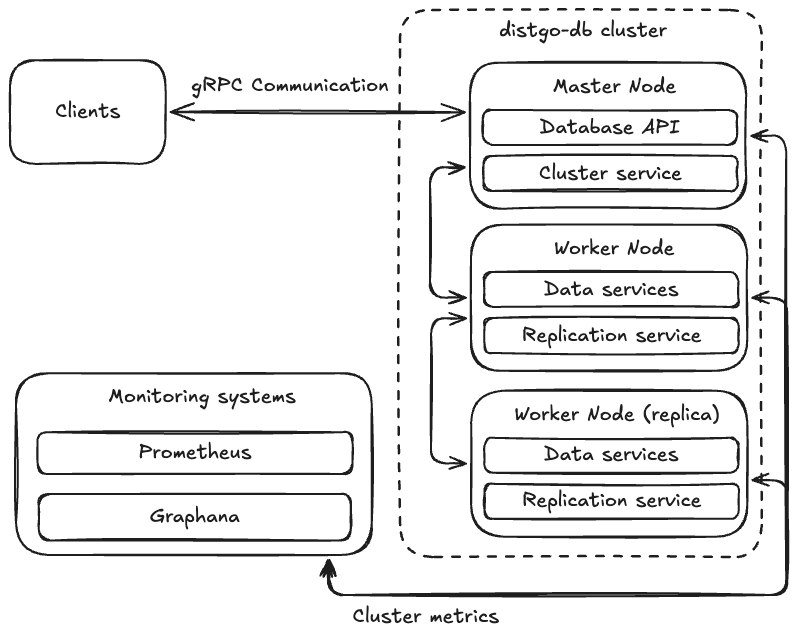

# distgo-db

Distributed document-oriented database written in Go

## 📦 What is it?

distgo-db is a learning/experimental project implementing a simple document-oriented database with support for CRUD operations, collections and gRPC API.

Written entirely in Go. Perfect for learning about database structure, gRPC, testing and possible expansion into a full-fledged distributed solution.

## ✅ Functionality

- Working with databases, collections, documents (in JSON format)
- gRPC API support
- In-memory storage with thread-safe access


## ✅ Architecture Overview

The architecture of the distgo-db cluster is designed to provide a scalable, fault-tolerant, and highly available distributed database system. The system is composed of several key components that work together to handle data storage, replication, and client communication.



## 🧾 Worker Node Configuration

This configuration defines settings for a worker node in a distributed system. It includes gRPC communication parameters and logging options.

### 📄 Example YAML Configuration

```yaml
name: worker_1
grpc:
  port: 55055
  timeout: 4s
logging:
  level: info
  format: pretty
  output: stdout
```

### 📊 Configuration Fields Explained

| Field              | Type     | Description                                                                 |
|--------------------|----------|-----------------------------------------------------------------------------|
| `name`             | string   | Unique identifier for the worker node (e.g., `worker_1`).                  |
| `grpc.port`        | integer  | Port number on which the gRPC server will listen (e.g., `55055`).          |
| `grpc.timeout`     | duration | Maximum time allowed for a gRPC request to complete (e.g., `4s`).           |
| `logging.level`    | string   | Logging severity level: `debug`, `info`, `warn`, `error`, etc.              |
| `logging.format`   | string   | Format style for log messages: `pretty` (human-readable), `json`, etc.      |
| `logging.output`   | string   | Destination for logs: `stdout`, `stderr`, or a file path (e.g., `logs.log`).|
